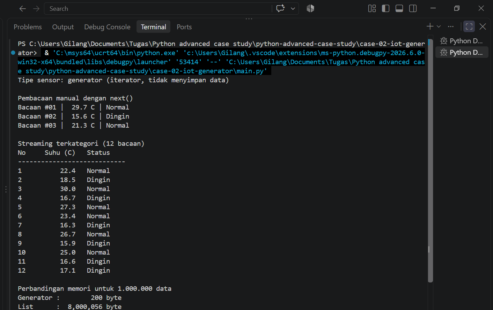

# Case 02 - Streaming Data Sensor IoT Hemat Memori

## Masalah yang Diselesaikan
Stasiun cuaca mengirim ribuan bacaan suhu per jam. Agar RAM tidak terkuras, data tidak dimuat sekaligus ke list, melainkan diproduksi dan diproses satu per satu (streaming). Setiap suhu langsung dikategorikan: Dingin (< 20), Normal (20-30), Panas (> 30). Program menampilkan 12 bacaan berturut-turut.

## Konsep Python yang Digunakan
- Iterator Pattern: konsumsi data bertahap dengan `next()` dan `for`.
- Generator Function: `sensor_suhu()` memakai `yield`.
- Efisiensi memori: tidak ada list besar; ada perbandingan ukuran generator vs list.

## Cara Menjalankan
```bash
cd case-02-iot-generator
python main.py
```
atau langsung run file main.py

## Bukti Eksekusi

